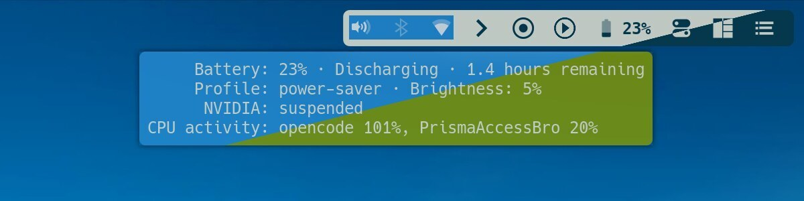
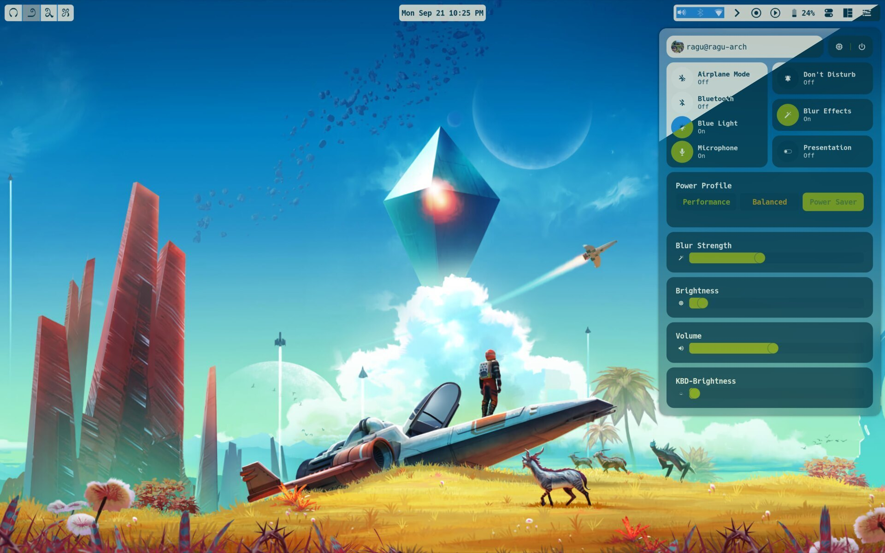
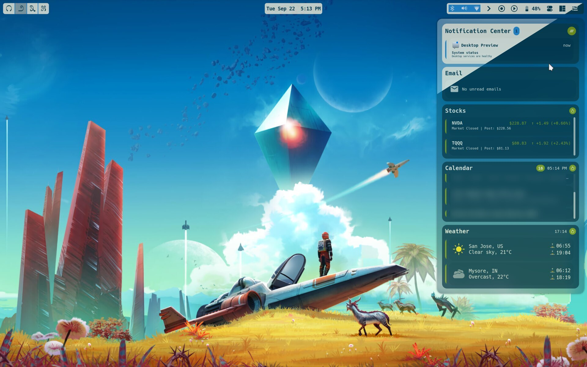

# Awesome Window Manager

<!--toc:start-->
- [Awesome Window Manager](#awesome-window-manager)
  - [Credits](#credits)
  - [Directory Structure](#directory-structure)
  - [Panels and Layouts](#panels-and-layouts)
  - [Widgets](#widgets)
    - [Top Panel](#top-panel)
    - [Control Center](#control-center)
    - [Info Center](#info-center)
    - [Calendar Center](#calendar-center)
    - [Playerctl Center](#playerctl-center)
  - [Modules](#modules)
  - [Outlook Calendar via Microsoft Graph API](#outlook-calendar-via-microsoft-graph-api)
  - [Theme](#theme)
  - [Configuration](#configuration)
    - [Display](#display)
    - [Weather](#weather)
    - [Stocks](#stocks)
    - [Calendar Events](#calendar-events)
    - [Dynamic Wallpaper](#dynamic-wallpaper)
    - [Lockscreen](#lockscreen)
    - [Screen Recorder](#screen-recorder)
  - [Key Bindings](#key-bindings)
  - [Startup Applications](#startup-applications)
  - [Utilities](#utilities)
  - [CI/CD](#cicd)
<!--toc:end-->


## Credits

Borrowed `surreal` theme of [the-glorious-dotfiles](https://github.com/manilarome/the-glorious-dotfiles) as reference and built my own 
version on top of it with extensive modifications for a production desktop environment on Arch Linux.


## Directory Structure

```sh
~/.config/awesome/
├── rc.lua                        # Main entry point
├── README.md                     # This file
│
├── configuration/                # All configuration
│   ├── config.lua                # Central config (display, widgets, modules)
│   ├── apps.lua                  # Default apps, startup list, utility paths
│   ├── client/                   # Client rules and titlebars
│   ├── keys/                     # Keybindings (global.lua, mod.lua)
│   ├── tags/                     # Tag definitions (9 icon-based tags)
│   ├── picom.conf                # Compositor configuration
│   ├── rofi/                     # Rofi themes (runmenu, appmenu, emoji, calc, time)
│   └── user-profile/             # User profile picture
│
├── layout/                       # Panel layouts
│   ├── init.lua                  # Panel creation per screen
│   ├── top-panel.lua             # Top bar
│   ├── control-center/           # System controls popup
│   ├── info-center/              # Notifications + email + stocks + calendar + weather
│   ├── calendar-center/          # Month calendar popup with clock
│   └── playerctl-center/         # Media player controls popup
│
├── widget/                       # 40 custom widgets
│   ├── battery/                  # Battery indicator with UPower
│   ├── calendar/                 # Month calendar with navigation
│   ├── calendar-events/          # Outlook calendar events list
│   ├── clock/                    # Clock widget
│   ├── email/                    # Email count (Outlook via OAuth2)
│   ├── notif-center/             # Notification center with history
│   ├── playerctl/                # Media player controls (via bling)
│   ├── screen-recorder/          # Screen recording toggle
│   ├── stocks/                   # Stock price ticker
│   ├── tag-list/                 # Workspace tag indicators
│   ├── task-list/                # Active window list
│   ├── weather/                  # Multi-provider weather
│   ├── brightness-slider/        # Display brightness control
│   ├── volume-slider/            # Volume control
│   ├── cpu-meter/                # CPU usage meter
│   ├── ram-meter/                # RAM usage meter
│   ├── harddrive-meter/          # Disk usage meter
│   ├── temperature-meter/        # Temperature monitor
│   ├── blue-light/               # Blue light filter toggle (redshift)
│   ├── bluetooth-toggle/         # Bluetooth on/off
│   ├── airplane-mode/            # Airplane mode toggle
│   ├── vpn/                      # VPN status/toggle
│   ├── kbd-battery/              # Keyboard battery level
│   ├── kbd-brightness-slider/    # Keyboard backlight slider
│   └── ...                       # Additional UI widgets
│
├── module/                       # System modules
│   ├── auto-start.lua            # Startup application launcher
│   ├── brightness-osd.lua        # Display brightness OSD
│   ├── kbd-brightness-osd.lua    # Keyboard brightness OSD
│   ├── volume-osd.lua            # Volume OSD
│   ├── mic-osd.lua               # Microphone mute/unmute OSD
│   ├── dynamic-wallpaper.lua     # Time-of-day wallpaper scheduler
│   ├── lockscreen.lua            # Lock screen with PAM auth
│   ├── exit-screen.lua           # Shutdown/reboot/suspend menu
│   ├── notifications.lua         # Notification handling
│   └── screen-manager.lua        # Multi-monitor connect/disconnect
│
├── utilities/                    # Functional helper groups (see utilities/README.md)
│   ├── camera/                   # Webcam capture and intruder photos
│   ├── desktop/                  # Theme recovery, profile, clock and volume applet
│   ├── display/                  # Topology, brightness, color and screenshots
│   ├── input/                    # Keyboard and touchpad controls
│   ├── network/                  # Outlook calendar and Prisma VPN helpers
│   └── power/                    # Power profiles, battery consumers and resume hook
│
├── theme/                        # Theme configuration
│   ├── init.lua                  # Theme loader (selects active theme)
│   ├── default-theme.lua         # Base theme defaults
│   ├── solarized-dark-theme/     # Solarized dark color scheme
│   ├── solarized-light-theme/    # Solarized light color scheme
│   ├── icons/                    # Widget and tag icons
│   └── wallpapers/               # Time-of-day wallpaper images
│
├── library/                      # Third-party libraries
│   ├── bling/                    # Bling (layouts, playerctl, signals)
│   ├── battery/                  # Battery widget library
│   ├── revelation/               # macOS Expose-like view
│   ├── stocks/                   # Stock price fetcher (Python/uv)
│   ├── volctl/                   # Per-app volume control
│   ├── tween/                    # Animation tweening
│   └── json.lua                  # JSON parser
│
└── tests/                        # Test suite
```

## Panels and Layouts

### Machine profile

Set the top-level `machine` field in `configuration/config.lua` to `laptop`,
`desktop`, or `imac`. Shared layouts omit whole battery, power-profile and
keyboard-backlight components when the profile or hardware does not support
them; disabled controls do not leave empty cards or instantiate unsupported
widgets. Display/audio identifiers and camera settings remain device data in
the same configuration file.

The shared brightness backend uses `light` for eDP/LVDS panels and EDID-selected
DDC for other outputs, including the iMac's DP-1 internal panel. No iMac-specific
brightness script or layout copy is required. User units remain installed:
systemd skips the lid manager without an ACPI lid and the power-source monitor
without a BAT battery, rather than requiring per-machine service drop-ins.

Five panels are created per screen:

| Panel | Key | Position | Content |
|-------|-----|----------|---------|
| Top Panel | (always visible) | Top edge | Tag list, task list, clock, systray, battery, toggles |
| Control Center | `Mod+c` | Top-right | User profile, brightness, volume, CPU/RAM/disk/temp meters, blur, blue-light, bluetooth, airplane, VPN |
| Info Center | `Mod+i` | Top-right | Notifications, email count, stock prices, calendar events, weather |
| Calendar Center | `Mod+Shift+c` | Top-center | Clock with dots, date, month calendar with navigation |
| Playerctl Center | `Mod+Shift+v` | Top-left | Media player controls (album art, play/pause, next/prev) |

Panels auto-hide when a client enters fullscreen and restore when exiting.

## Widgets

### Top Panel

- **Tag List** -- 9 workspace indicators with icon-based tags
- **Task List** -- Active window list for current tag
- **Clock** -- Time display (12h/24h configurable)
- **System Tray** -- Shown on external monitor when available
- **Screen Recorder** -- Toggle recording indicator
- **Playerctl Toggle** -- Media player center toggle
- **Keyboard Battery** -- External keyboard battery level
- **Battery** -- Laptop battery with UPower integration
- **Control Center Toggle** -- Opens system controls
- **Info Center Toggle** -- Opens info panel

<p align="center">
  
</p>

### Control Center

- User profile with hostname
- Focused-display brightness slider and screen-brightness keys: `light` for the
  laptop panel, DDC/CI (`ddcutil`) for external monitors selected by EDID.
- Volume slider
- Keyboard brightness slider
- CPU, RAM, hard drive, and temperature meters
- Blur toggle, blue-light filter (redshift), bluetooth, airplane mode, VPN, do-not-disturb, microphone toggle

The laptop blue-light filter retains its Redshift configuration. External
monitors use Redshift's location and a gentler 5500 K/4500 K schedule to adjust
DDC RGB gains, without lowering hardware brightness. This requires Custom Color
and RGB gain support. Kelvin-to-gain conversion is approximate; the original
preset and gains are saved under `$XDG_STATE_HOME/awesome/display-control` and
restored when filtering is disabled. DDC requests run asynchronously with
coalesced slider writes; there is no continuous brightness poller.

Volume and microphone controls also follow the focused display. Their ALSA card
selectors are configured in `widget.audio`; gestures capture the target before
asynchronous work starts, and status/OSD replies are tagged with that output.
Audio events, panel opening and hover refresh the current endpoint without a
repeating status timer. Missing monitor audio is explicitly unavailable and is
never redirected to the laptop's device. Default audio devices remain under the
session manager/user's control. Blue light and blur remain global controls;
system-wide controls such as Bluetooth, airplane mode and power profiles manage
the host rather than a particular screen.

<p align="center">
  
</p>

### Info Center

Control, Info and Playerctl centers retain their screen-relative width; Calendar
Center fits its content. All four align their top edge with tiled clients and
notification popups using the theme's outer gap. Height
limits use the owning screen's usable pixels without applying DPI twice. Info Center's
existing list viewports share the available height; headers remain visible and
wheel scrolling stays inside the original notification, mail, stock, calendar
and weather sections. There is no extra whole-panel scrollbar.

Email and notification lists snap one card per wheel step, using the same
card-centering calculations as the calendar. Forward and reverse scrolling use
the same valid positions, including at the top/bottom boundaries. When space
allows, those viewports reserve at least one complete card instead of cutting
off its subject, timestamp or notification actions.

- Notification center with history and clear-all
- Email unread count (fetched via OAuth2 IMAP)
- Stock price ticker (configurable symbols, auto-refresh)
- **Calendar events** (Outlook via Microsoft Graph API)
- Weather (multi-provider, multi-location)

<p align="center">
  
</p>

### Calendar Center

- Analog-style clock display with dot separators
- Full date display
- Interactive month calendar with left/right navigation arrows
- Highlights current day and weekends

Its native popup width follows the clock, date and month grid rather than a
screen fraction, with navigation padding included and a screen-width cap. Arrow
buttons use the same accent/hover styling as Info Center controls. Weekend cells
use the theme's icon color with contrasting text; today keeps its accent highlight.

Click the month heading to choose a month, or the year to browse twelve-year
pages. Selecting a year opens its month chooser. The arrows change months,
years or year pages according to the current view. **Today** returns to the
current date; **Go to date** accepts `YYYY`, `YYYY-MM` or `YYYY-MM-DD` (Enter to
apply, Escape to dismiss without changing the date, Ctrl+U to clear). Hover the
entry for a hand cursor and format/keyboard help; clicking focuses its blinking
caret. Clicking outside the entry (including elsewhere inside Calendar Center),
focusing another client/widget, leaving the center or locking releases
the calendar's keyboard grab and stops blinking.
The empty input shows `YYYY-MM-DD`; invalid dates show an inline message
and keep the prompt open for correction. Ordinary digits and numeric keypad
digits are accepted. The month/year heading is centered above the day grid.
The entry uses the clickable-button theme colors;
invalid input highlights its border in red.

Holiday markers cover the previous, current and next calendar year. US nationwide
holidays are synchronized from Nager.Date, with federal actual/observed dates as
an offline fallback. Work-calendar holidays automatically reuse Info Center's
existing Graph OAuth script and token when available: only non-cancelled all-day
entries matching holiday/closure titles are included, with pagination. Regular
meetings are not stored. `widget.calendar_holidays.company_pattern` can refine
the title filter; no second login or opt-in is required.

US markers use cyan borders; work markers use magenta. Hovering a marked day
shows its holiday titles as plain text, including both sources on shared dates.
The private cache is `${XDG_CACHE_HOME:-~/.cache}/awesome/calendar-holidays.json`.
Opening Calendar Center checks the cache; successful syncs are reused for a day,
failed sources retry after an hour while cached/offline data remains available.
The small refresh button forces a sync and its tooltip reports the cached range
and source errors. Sync is bounded and asynchronous, without a new polling timer.

### Playerctl Center

- Media player controls via bling/playerctl integration

## Modules

| Module | Description |
|--------|-------------|
| `auto-start` | Runs startup applications listed in `apps.lua` |
| `brightness-osd` | On-screen display for brightness changes |
| `kbd-brightness-osd` | On-screen display for keyboard backlight changes |
| `volume-osd` | On-screen display for volume changes |
| `mic-osd` | On-screen display for microphone mute/unmute |
| `dynamic-wallpaper` | Schedules wallpaper changes based on time of day (25+ time slots) |
| `lockscreen` | Lock screen with PAM authentication, webcam intruder capture, blurred background |
| `exit-screen` | Shutdown, reboot, suspend, and log-out menu |
| `notifications` | Custom notification handling and display |
| `screen-manager` | Graceful handling of monitor connect/disconnect events |

### Intruder camera selection

When intruder capture is enabled, the lockscreen prefers
`module.lockscreen.external_camera_device` while the configured external display
is active. This accepts a stable `/dev/v4l/by-id/` path or glob; the Dell monitor
pattern selects its color camera's `video-index0`, not a metadata or IR node.
The device is resolved on every attempt, so USB reconnects and changed
`/dev/videoN` numbering do not require restarting Awesome.

If the external camera is absent, busy, or fails to capture, the helper tries
`module.lockscreen.camera_device` instead. With no active external display, it
uses that built-in camera directly. Attempts are bounded and asynchronous,
partial images are removed, and successful photos are saved with private
permissions in `face_capture_dir`. Capture completion cannot reopen the wanted
poster after successful authentication. The camera-selection tests use fake
devices and capture scripts and require no camera or X server in CI.

## Outlook Calendar via Microsoft Graph API

The calendar events widget fetches events from Outlook via the Microsoft Graph
API. The `utilities/network/outlook-calendar` script:

- Reuses the neomutt OAuth2 infrastructure (`~/.config/neomutt/accounts/work/oauth2.py`)
- Uses a dedicated Graph API token (`~/.config/neomutt/credentials/token_outlook_graph`)
- Queries `graph.microsoft.com/v1.0/me/calendarview` for events
- Returns JSON with subject, start/end times, location, organizer, response status
- Supports `--date`, `--days`, `--oauth-script`, `--token-file` arguments

The Lua widget (`widget/calendar-events/init.lua`) renders events as a
scrollable list with:
- Event count badge and refresh button
- Concurrent event grouping with expand/collapse
- Auto-scroll to current or next upcoming event
- Today/Tomorrow/day-of-week labels
- Missed event indicators

See the [Neomutt README](../neomutt/README.md#graph-api-token-outlook-calendar)
for Graph API token setup.

## Theme

Solarized color scheme with light and dark variants, switchable via
[darkman](https://darkman.whynothugo.nl/):

- `theme/solarized-dark-theme/` -- Default dark theme
- `theme/solarized-light-theme/` -- Light theme
- Theme selection in `theme/init.lua`
- Darkman integration auto-switches theme based on time/location

Fonts: Hack Nerd Font throughout (configurable via theme).

## Configuration

All settings are centralized in `configuration/config.lua`:

### Display

```lua
display = {
    dpi = 192,
    primary = { name = 'eDP-1', mode = '3840x2400' },
    external = { name = 'DP-4', mode = '3440x1440', scale_from = '3840x2400' },
}
```

The `utilities/display/read-display-config` script reads this Lua config for use by
shell scripts (`setup-monitors`, `connect-external`, `disconnect-external`).

### Weather

Multi-provider with automatic fallback: Open-Meteo, wttr.in, OpenWeather.
Supports multiple locations with per-location coordinates and timezone.

### Stocks

```lua
stocks = {
    symbols = { "NVDA", "TQQQ", "TECL" },
    update_interval = 300,
}
```

### Calendar Events

```lua
calendar_events = {
    script = config_dir .. 'utilities/network/outlook-calendar',
    window_days = 2,
    max_items = 0,        -- 0 = show all
    show_cancelled = false,
}
```

### Dynamic Wallpaper

By default, the scheduled image fills each screen independently while preserving
its aspect ratio (cropping excess edges rather than distorting the image).
`module.dynamic_wallpaper.stretch = true` explicitly opts into a panorama across
the combined desktop. Wallpaper fitting and center sizing use the geometry
reported by X11; RandR `scale_from` is not an additional wallpaper/UI scale.

Time-scheduled wallpaper rotation with 25+ time slots across 24 hours.
Wallpapers stored in `theme/wallpapers/`. The `suspend-hook.py` utility
updates wallpaper when resuming from sleep.

### Lockscreen

- Password PAM and asynchronous fingerprint authentication run independently
- Fingerprint verification accepts any enrolled finger and stops while the display is off or suspended
- Optional webcam capture on rejected password and fingerprint attempts
- Idle locking waits for active audio only while unlocked; a locked display turns off after one minute
- Blurred background option

### Docked Lid and Display Recovery

The lid brightness manager owns a `handle-lid-switch` inhibitor while the
configured external output has active geometry. Closing the lid saves the
internal backlight level and sets it to zero; reopening restores that level.

A failed or timed-out X11 query is an unknown state, not a disconnected monitor.
It preserves existing inhibition and brightness state until a successful query
allows reconciliation. Display setup reloads the manager with SIGHUP so routine
screen reconfiguration does not drop the inhibitor by restarting the service.

Behavioral tests exercise close/open, inactive outputs, failed queries, recovery,
and live-process reloads with mocked hardware. Idle locking remains separate:
`xidlehook` locks and applies DPMS, without requesting system suspend.

### Screen Recorder

```lua
screen_recorder = {
    display_target = 'external',
    audio = false,
    save_directory = '$HOME/Videos/Recordings/',
    fps = '60',
}
```

The configured `display_target` is the initial preference. The recorder settings
offer Primary, External, Both, and a mouse-drag Area selected with `slop`.
External targets are disabled while disconnected instead of silently recording
the primary display. Keys `1` through `4` choose a source and Escape returns to
the recorder. The selected source, microphone mode, and last custom region are
stored under `$XDG_STATE_HOME/awesome/screen-recorder/settings`; selecting Area
reuses that region, while selecting an active Area again redraws it. When
`XDG_STATE_HOME` is unset, the state path is
`~/.local/state/awesome/screen-recorder/settings`.

Runtime dependencies: `ffmpeg`, `slop`, and `wpctl` from WirePlumber.

## Key Bindings

Mod key is `Super` (Windows key).

| Key | Action |
|-----|--------|
| `Mod+Return` | Open terminal (Alacritty) |
| `Mod+a` | Application drawer (rofi drun) |
| `Mod+e` | Run menu (rofi) |
| `Mod+Ctrl+e` | Emoji picker |
| `Mod+Ctrl+c` | Calculator (rofi-calc) |
| `Mod+g` | Web browser (Firefox) |
| `Mod+s` | Show keybinding help |
| `Mod+c` | Control center |
| `Mod+i` | Info center |
| `Mod+Shift+c` | Calendar center |
| `Mod+r` | Revelation (Expose view) |
| `Mod+p` | Toggle previous tag |
| `Mod+Ctrl+h` | Previous tag with clients |
| `Mod+Ctrl+l` | Next tag with clients |
| `Mod+Space` | Next layout |
| `Mod+Shift+Space` | Previous layout |
| `Mod+Ctrl+Space` | Toggle floating |
| `Mod+b` | Toggle blue-light filter |
| `Mod+t` | Show time (rofi) |
| `Mod+Ctrl+t` | Toggle blur effects |
| `Mod+Shift+t` | Toggle touchpad |
| `Mod+d` | Destroy all notifications |
| `Mod+Ctrl+n` | Clear notification center |
| `Mod+Ctrl+m` | Refresh stock prices |
| `Mod+Shift+m` | Find cursor location |
| `Mod+Ctrl+p` / `Print` | Fullscreen screenshot |
| `Mod+Shift+p` / `Shift+Print` | Area screenshot |
| `Mod+Shift+l` | Lock screen |
| `Mod+Ctrl+q` | Exit screen (shutdown/reboot/suspend) |
| `Mod+Ctrl+r` | Reload AwesomeWM |
| `Mod+Ctrl+d` | Memory statistics |

Tag navigation: `Mod+[1-9]` to switch, `Mod+Shift+[1-9]` to move client.

## Startup Applications

Configured in `configuration/apps.lua`, launched via `module/auto-start.lua`:

- **picom** -- Compositor with blur and transparency
- **xiccd** -- ICC color profile daemon
- **nm-applet** -- NetworkManager tray applet
- **blueman-applet** -- Bluetooth tray applet
- **lxqt-policykit-agent** -- Authentication agent
- **setup-monitors** -- Display arrangement
- **redshift** -- Blue-light filter
- **xidlehook** -- Audio-aware idle lock and locked-screen DPMS control
- **darkman** -- Dark/light theme switching
- **watch-email.sh** -- IMAP email notifications (goimapnotify)
- **suspend-hook.py** -- Wallpaper update on sleep/wake
- **volctl** -- Per-app volume control
- **playerctld** -- Media player daemon

## Utilities

Utilities are organized into `camera/`, `desktop/`, `display/`, `input/`,
`network/` and `power/`. See [the helper inventory](utilities/README.md) for
individual scripts and their dependencies.

Generated workspace state is stored in
`${XDG_STATE_HOME:-$HOME/.local/state}/awesome/last-workspace`, with migration
from the old utility-directory marker. Runtime state does not belong in the
helper source tree.

## CI/CD

GitHub Actions workflow (`.github/workflows/awesome-wm-tests.yml`) runs on Arch
Linux containers with 8 test jobs:

1. **Lua Syntax Validation** -- luacheck + luac on all Lua files
2. **Config Load Test (Lua 5.4)** -- awesome-git from AUR, `awesome --check`, awmtt runtime test
3. **Config Load Test (LuaJIT)** -- awesome-luajit-git from AUR, awmtt runtime test
4. **Bash Scripts Validation** -- shellcheck + executability checks on all utilities
5. **Display Configuration Tests** -- Validates `config.lua` display section and `read-display-config`
6. **Module Import Tests** -- Tests standalone module imports (config, apps, keys.mod)
7. **Integration Tests** -- Verifies monitor scripts use `read-display-config`
8. **Security Scan** -- Checks for hardcoded secrets, API keys, file permissions
