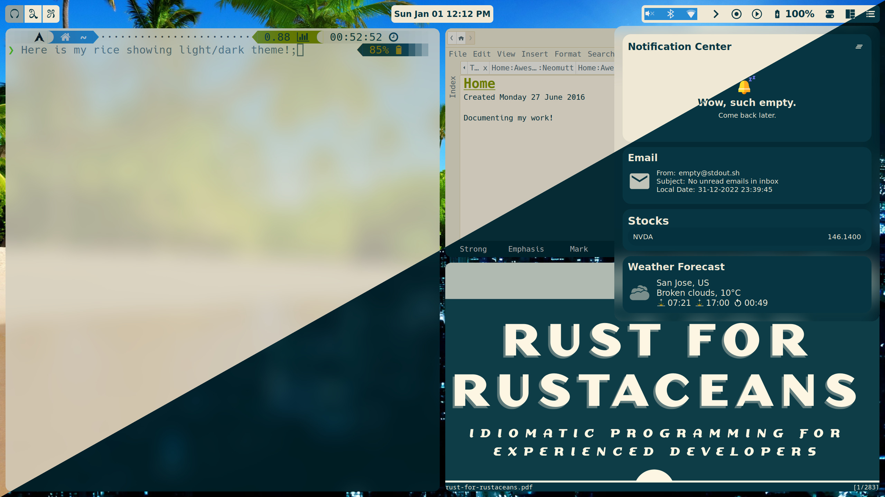

# Profile Management with Git and GitHub

## Screenshots

### [rEFInd](.config/rEFInd)

|  |
|:--:|
| ***EFI boot picker screen*** |

|  |
|:--:|
| ***EFI menu screen*** |

### [ZSH](.config/zsh)

|  |
|:--:|
| ***ZSH command prompt with powerlevel9k theme*** |

|  |
|:--:|
| ***ZSH command prompt with auto-suggestions*** |

### [Tmux](.config/tmux)

|  |
|:--:|
| ***TMUX status line showing host OS, session name and other things*** |

### [Nvim](.config/nvim)

|  |
|:--:|
| ***Neovim setup, customized for C++ developement*** |

### [Neomutt](.config/neomutt)

|  |
|:--:|
| ***Neomutt setup, terminal based email utility*** |

### [AwesomeWM](.config/awesome)

|  |
|:--:|
| ***AweomeWM - Alacritty, Zim, Zathura and notifications panel*** |

|  |
|:--:|
| ***AweomeWM - firefox*** |

## Setup/Install

### Run the bootstrap script
`$ bash -c "$(curl -fsSL https://raw.githubusercontent.com/ragu-manjegowda/config/master/.config/scripts/bootstrap.sh)"`


## The following describes a simple way to manage profile configuration files using GitHub.

### Features

*   Centralized configuration management
*   Files live in their native locations (no symbolic linking)
*   Home directory is not a Git repository
*   All the power of git with a simple alias

### Setup Repository

*   Log into [GitHub](https://github.com/ "GitHub") and create a repository named config
*   Add your [public keys to GitHub](https://github.com/guides/providing-your-ssh-key "Public Keys to GithHub") (if you haven’t done so already)
*   Open a terminal and switch to your home directory
    `$ cd ~`
*   Create a configuration directory
    `$ mkdir .config.git`
*   Add the following alias to your `.bashrc` and/or your `.bash_profile`
    `alias config='git --git-dir=$HOME/.config.git/ --work-tree=$HOME'`
*   Add your `.bash_profile` to the configuration repository
    `$ config add .bash_profile`
*   Commit the changes
    `$ config commit -m 'Initial commit'`
*   Change the origin to GitHub
    `$ config remote add origin git@github.com:GITHUB_USERNAME/config.git`
*   Push the changes
    `config push origin master`

If you get an error when running `config pull` to the effect of `You asked me to pull without...` run the follow:

```
$ echo -e '[branch "master"]\n  remote = origin\n  merge = refs/heads/master' >> ~/.config.git/config
```

### Setup Configuration Management on a Different System
1.  Add your [public keys to GitHub](https://github.com/guides/providing-your-ssh-key "Public Keys to GithHub") (if you haven’t done so already)
2.  Switch to your home directory
    `$ cd ~`
3.  Backup your local configuration files, example:
    `$ mv .bash_profile .bash_profile.bk`
    `$ mv .bashrc .bashrc.bk`
4.  Clone your configuration repository
    `$ git clone git@github.com:GITHUB_USERNAME/config.git config.git`
5.  Move the git metadata to `~/.config.git`
    `$ mv config.git/.git .config.git`
6.  Enable dotglob
    `$ shopt -s dotglob`
7.  Move your configuration files to your home directory
    `$ mv -i config.git/* .`
8.  Delete the `config.git` directory
    `$ rmdir config.git`
9.  Logout and log back in
10. ***Note: Sub-modules needs to be updated***
    `$ git submodule update --remote --rebase`

### Git tracking using vim plugins
1.  Set `core.worktree` like the following
    `$ git --git-dir=$HOME/.config.git --work-tree=$HOME config --local core.worktree $HOME`
2.  open files of this repository with the alias `cvim`


### Basic Usage
*   `config pull` - get latest configuration changes
*   `config add FILENAME` - add a configuration file
*   `config commit -a` - save all configuration changes
*   `config push` - push configuration changes to GitHub
*   and any other `config GIT_OPTION`

### Reference

* [http://github.com/silas/config](https://github.com/silas/config "config").
* Source: [Manage your $HOME with git](http://robescriva.com/2009/01/manage-your-home-with-git/ "source") by Robert Escriva
